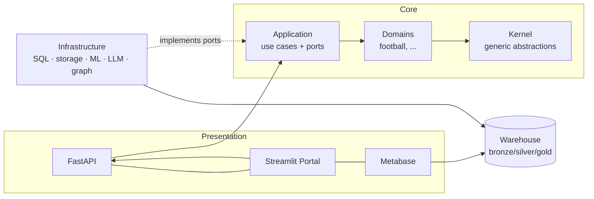

# FootballIQ Enterprise

[](https://github.com/zoeb7184/footballiq/actions/workflows/ci.yml)
[](CHANGELOG.md)
[](pyproject.toml)
[](LICENSE)

**An enterprise AI decision-intelligence platform, demonstrated on football analytics.**

Football is the demonstration domain, not the product. FootballIQ is built as a
**domain-agnostic** decision-intelligence core — a medallion data warehouse, a
versioned API, explainable ML, graph analytics, and a grounded RAG assistant —
with the business domain as a pluggable package. Retargeting to manufacturing,
finance, healthcare, logistics, or retail means swapping the domain package and
the ingestion adapters; nothing else changes.

It is built to showcase production engineering practices end to end:

- **Clean Architecture** with a strict, mechanically-enforced dependency rule
- **Data warehousing** on a bronze/silver/gold medallion (dbt, 68 data contracts)
- **FastAPI** read layer with typed, status-discriminated contracts
- **Explainable AI** — gated ML valuations with exact per-player SHAP
- **Graph analytics** — a club↔nation talent-flow network (NetworkX)
- **Grounded RAG** — a single-turn analyst where every number traces to SQL
- **API-first design** — the portal consumes the public API only
- **Infrastructure as Code** — Azure via Bicep, validated in CI
- **CI/CD** — the local quality gate runs verbatim in GitHub Actions

---

## Architecture at a glance



Clean architecture with a strict inward dependency rule — see
[ADR-0002](docs/adr/0002-clean-architecture-with-domain-agnostic-kernel.md).
Local-first runtime, Azure-ready by construction — see
[ADR-0003](docs/adr/0003-local-first-azure-ready-deployment.md).

---

## Capabilities

All modules are shipped. Each was delivered with a design doc, tests, the
full quality gate green, a module report, and a tagged release.

| Module | Capability | Status |
|:------:|------------|:------:|
| 0 | Foundation: scaffold, ADRs, quality gates | ✅ |
| 1 | Domain core (entities, value objects) | ✅ |
| 2 | Data platform: ingestion + medallion warehouse | ✅ |
| 3 | FastAPI backend | ✅ |
| 4 | BI dashboards (Metabase, ADR-0005) | ✅ |
| 5 | ML + explainable AI (SHAP) | ✅ |
| 6 | Graph analytics | ✅ |
| 7 | LLM + RAG assistant | ✅ |
| 8 | Streamlit customer portal (API-contract reference client) | ✅ |
| 9 | Docker, CI/CD, Bicep IaC | ✅ |
| 10 | Match simulation + model governance API (ADR-0006) | ✅ |
| — | **Production web app** (`web/`, Next.js — the public face) | ✅ |

### The web application

`web/` is a production Next.js frontend over the public API only: interactive
dashboards, the scout shortlist, per-player SHAP waterfalls with a
browser-side additivity proof, the grounded AI analyst with SQL-sourced facts
and citations, the talent-flow network, a seeded Monte Carlo match simulator,
and a model-governance page. Design rationale in `FRONTEND_BLUEPRINT.md`;
free-tier deployment (Neon + Render + Vercel) in
`docs/deployment-free-tier.md`.

```bash
cd web && npm install && cp .env.example .env.local && npm run dev
# needs the API running: make api  (http://localhost:8000)
```

---

## Quickstart

### 1. Installation

```bash
make install                     # package + dev tooling + pre-commit hooks
pip install -e ".[dev,rag,portal]"   # add ML, RAG (embeddings), and portal extras
```

### 2. Data preparation

Datasets are never committed (git holds code, not data — see `.gitignore`). The
platform ingests a public **FIFA World Cup 2026** CSV dataset from Kaggle.

> **Source:** [FIFA World Cup 2026 dataset on Kaggle](https://www.kaggle.com/datasets/mominullptr/fifa-world-cup-2026-dataset)

Download it and place these 11 files into `data/raw/` before running
`make pipeline` (the source manifest is
[`manifest.py`](src/footballiq/infrastructure/ingestion/manifest.py)):

```text
teams.csv              venues.csv            tournament_stages.csv
referees.csv           matches.csv           matches_detailed.csv
squads_and_players.csv player_stats.csv      match_team_stats.csv
match_lineups.csv      match_events.csv
```

`make pipeline` validates that every declared file is present before ingesting.

### 3. Local development

```bash
make check       # lint (ruff) + strict types (mypy) + import-linter + tests
make db-up       # start the warehouse (Postgres via docker compose)
make pipeline    # bronze ingestion -> dbt silver/gold -> 68 data contracts
```

`make check` is exactly what CI runs — no drift between local and the pipeline.

### 4. Verification

```bash
make check       # the full quality gate (must be green)
make demo        # end-to-end build + smoke check (see below)
```

---

## Running the full demo

> [!IMPORTANT]
> The complete demo needs **three services running at the same time**. The
> Streamlit portal will not work unless the API is already running — it reads
> the public API only, never the database.

| Service | Command | URL | Notes |
|---------|---------|-----|-------|
| FastAPI | `make api` | <http://localhost:8000/docs> | Required for all API and portal requests |
| Streamlit portal | `make portal` | <http://localhost:8501> | Uses only the public API |
| Metabase | `make bi-up` | <http://localhost:3000> | Runs inside Docker |

**Open separate terminals for the API and the portal.** Metabase runs in Docker
and does not occupy a terminal.

**Terminal 1 — API**

```bash
make api
```

**Terminal 2 — portal** (start after the API is up)

```bash
make portal
```

**Metabase** (Docker, no dedicated terminal)

```bash
make bi-up
```

---

## Demo walkthrough

A step-by-step run from a clean checkout:

```bash
# 1. Install everything the demo touches
pip install -e ".[dev,rag,portal]"

# 2. Start the warehouse
make db-up

# 3. Build the data pipeline (bronze -> silver -> gold, with data contracts)
make pipeline

# 4. Build every analytics layer end-to-end, then smoke-check it
make demo        # features -> model + SHAP -> graph -> RAG index -> verify

# 5-7. Start the three services (in their own terminals / Docker)
make api         # Terminal 1
make portal      # Terminal 2 (after the API is up)
make bi-up       # Docker
```

`make demo` fails loudly if any layer produced no data
([`demo_smoke.py`](scripts/demo_smoke.py) prints a row count per layer), so the
demo cannot fake success.

What each surface demonstrates:

- **API (`/docs`)** — the versioned, prediction-as-data read layer and the
  grounded RAG analyst.
- **Portal** — a customer client built entirely on the public API (Scout
  Shortlist, Talent Flow, Ask the Analyst).
- **Metabase** — executive and talent-valuation dashboards over the gold layer.

### Example review flow

After launching all three, a reviewer can experience the platform in a couple of
minutes:

1. **Open Swagger** at <http://localhost:8000/docs>, click **Authorize**, and
   enter the dev key `dev-local-key`.
2. **Ask the Analyst** — `POST /v1/analyst/ask` with
   `{"question": "Which player is most undervalued?"}` and note that every number
   in the answer is backed by a `facts` entry sourced from a gold table.
3. **Open the Streamlit portal** at <http://localhost:8501>.
4. **Inspect Talent Flow** — the top supplier clubs and each nation's supply
   concentration (HHI).
5. **Open Scout Shortlist** — the value-gap ranking; pick a player to see their
   predicted-vs-market value and the SHAP drivers behind it.
6. **View the Metabase dashboards** at <http://localhost:3000> — the same figures
   the API serves, rendered for executives.

> [!TIP]
> Prefer raw JSON? Try `GET /v1/matches/89`: a scheduled knockout fixture has no
> score field at all, and its undetermined opponent is an explicit typed state —
> the data contract, visible in the response.

---

## Documentation

**Architecture & decisions**

- Architecture decision records — [`docs/adr/`](docs/adr/)
- C4 context & docs-as-code — [`docs/architecture/`](docs/architecture/)
- Backend / API design — [`docs/api/backend-design.md`](docs/api/backend-design.md)

**Design specifications**

- ML & explainability — [`docs/ml/`](docs/ml/), [`docs/ai/rag-design.md`](docs/ai/rag-design.md)
- Graph analytics — [`docs/analytics/graph-design.md`](docs/analytics/graph-design.md)
- Data model & warehouse — [`docs/data/`](docs/data/)
- Product scope & PRD — [`docs/product/`](docs/product/)

**Delivery & operations**

- Per-module reports — [`docs/modules/`](docs/modules/)
- Azure deployment architecture — [`docs/infra/azure-architecture.md`](docs/infra/azure-architecture.md)
- Infrastructure as Code (Bicep) — [`infra/bicep/README.md`](infra/bicep/README.md)
- Operations runbook — [`docs/runbook.md`](docs/runbook.md)
- Architecture review — [`docs/reviews/`](docs/reviews/)

**Project**

- Contributing & engineering standards — [`CONTRIBUTING.md`](CONTRIBUTING.md)
- Changelog — [`CHANGELOG.md`](CHANGELOG.md)
- License (MIT) — [`LICENSE`](LICENSE)

---

## Deployment

Local is the source of truth; Azure is placement, not redesign (ADR-0003). The
same containers run locally (compose) and in the cloud (Azure Container Apps),
the same `make check` runs locally and in CI, and the same idempotent init SQL
migrates both.

- **CI** ([`.github/workflows/ci.yml`](.github/workflows/ci.yml)) runs the full
  quality gate on every PR.
- **Deploy** ([`.github/workflows/deploy.yml`](.github/workflows/deploy.yml))
  validates the Bicep, builds the image, deploys staging, smoke-tests `/ready`,
  then promotes to production behind a manual approval.
- **IaC** ([`infra/bicep/`](infra/bicep/)) provisions Azure Container Apps,
  PostgreSQL Flexible Server (pgvector), ACR, Key Vault, Blob, and Log Analytics.

See the [operations runbook](docs/runbook.md) for deploy, rollback,
backup/restore, and incident response.

---

## License

Released under the [MIT License](LICENSE).
