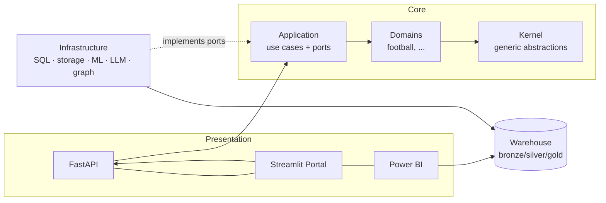

# FootballIQ Enterprise

[](https://github.com/zoeb7184/footballiq/actions/workflows/ci.yml)

**Enterprise AI Decision Intelligence Platform** — demonstrated on football analytics.

Football is the showcase domain, not the product. The platform is built as a
domain-agnostic decision-intelligence core (data warehouse, APIs, ML with
explainability, graph analytics, LLM+RAG assistant) with pluggable business
domains. Retargeting to manufacturing, finance, healthcare, logistics, or
retail means swapping the domain package and ingestion adapters — nothing else.

## Architecture at a glance



Clean architecture with a strict inward dependency rule — see
[ADR-0002](docs/adr/0002-clean-architecture-with-domain-agnostic-kernel.md).
Local-first runtime, Azure-ready by construction — see
[ADR-0003](docs/adr/0003-local-first-azure-ready-deployment.md).

## Capabilities (roadmap)

| Module | Capability | Status |
|---|---|---|
| 0 | Foundation: scaffold, ADRs, quality gates | ✅ |
| 1 | Domain core (entities, value objects) | ✅ |
| 2 | Data platform: ingestion + medallion warehouse | ✅ |
| 3 | FastAPI backend | ✅ |
| 4 | BI dashboards (Metabase, ADR-0005) | ✅ |
| 5 | ML + explainable AI (SHAP) | ✅ |
| 6 | Graph analytics | ✅ |
| 7 | LLM + RAG assistant | ⏳ |
| 8 | Streamlit customer portal | ⏳ |
| 9 | Docker, CI/CD, Bicep IaC | ⏳ |

## Quickstart

```bash
make install   # package + dev tooling + pre-commit hooks
make check     # lint + strict type-check + import-linter + tests (the CI gate)
make db-up     # warehouse (Postgres via docker compose)
make pipeline  # bronze ingestion -> dbt silver/gold -> 68 data contracts
```

**Data setup:** datasets are never committed (see `.gitignore`). Place the
FIFA World Cup 2026 CSVs (Kaggle) into `data/raw/` before running
`make pipeline` — the 11 expected files are declared in
`src/footballiq/infrastructure/ingestion/manifest.py`.

**Try the API:** `cp .env.example .env && make api`, then open
http://localhost:8000/docs and authorize with the dev key `dev-local-key`.
Look at `GET /v1/matches/89`: a scheduled knockout fixture has no score
field at all, and its undetermined opponent is an explicit typed state —
the data contract, visible in raw JSON.

## Documentation

- Architecture decisions: [`docs/adr/`](docs/adr/)
- Diagrams (C4, docs-as-code): [`docs/architecture/`](docs/architecture/)
- Engineering standards: [`CONTRIBUTING.md`](CONTRIBUTING.md)
