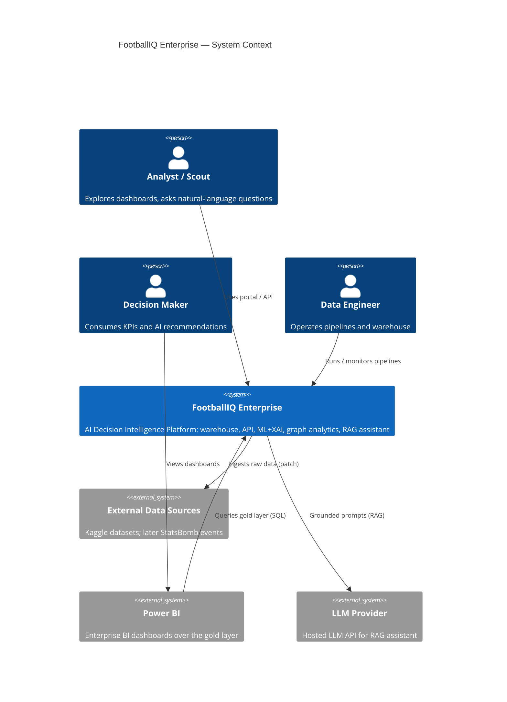

# C4 Level 1 — System Context

FootballIQ Enterprise as a black box: who uses it, what it talks to.

## Notes
- Football is the demonstration domain. Replacing `sources` and
  `domains/football` retargets the platform to another industry (ADR-0002).
- Level 2 (containers) will be added in Module 2 when the runtime
  components (API, warehouse, pipelines, portal) exist.
