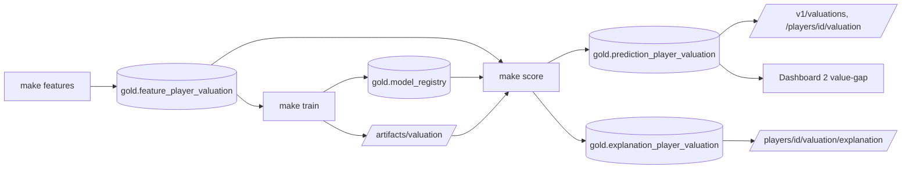

# Module 5 — ML + Explainable AI (SHAP)

## 1. Requirements
The two scope.md models' first deliverable: a player **valuation** model with
per-player **SHAP** explanations, served as data through the read-only API and
surfaced on Dashboard 2. Cross-sectional valuation only this module; the outcome
model and its global importance are sequenced later. Honest accuracy, reported
as-is — no metric theatre.

## 2. Architecture
Prediction-as-data (ML design §7, §9): **nothing infers at request time.** A
batch pipeline writes predictions and explanations to gold; the API and BI only
read them.

Layers hold (ADR-0002): `ml` sits above `infrastructure`; the API reads the
scoring tables through the same gold-adapter port pattern as every other read
model. Registry and scoring tables are tables **we fully own** (ML design §10).

## 3. Design rationale
- **Baselines-first gate.** The XGBoost model is registered production only if
  it beats *both* a position-median and a ridge-linear baseline on pooled
  out-of-fold RMSLE (grouped CV by national team). It passed on real data —
  RMSLE 0.937 vs 0.942 linear vs 1.698 median — but the margin is thin, and we
  report it that way. MdAPE ~50%, ~20% within +/-20%.
- **Log-space SHAP is the only correct decomposition.** The model predicts
  `log1p(value)`, so SHAP is additive in log space; euro-additive breakdowns are
  mathematically wrong. Canonical stored form is `shap_log`; the display form is
  the multiplicative factor `exp(phi)` (XAI design §2).
- **Additivity as an enforced invariant.** At scoring time an independent margin
  must equal `base + sum(phi)` for every player or the load is refused. Verified
  again from the warehouse side (worst residual 3.03e-05 across 1248 players).
- **Leak-proof by construction.** The label joins only at training time; a CI
  battery bans label lineage and audits feature/registry completeness.
- **Structural states, not nulls.** Reserved dimension members are excluded from
  scoring; an unscored/unknown player is a 404, never a fabricated number.

## 4. Implementation
Four vertical slices, each with tests, a registry/lineage trail, and a report:
- **Slice 1 — features:** `make features` builds `gold.feature_player_valuation`
  (1248 rows, v1.0.0); 15 declared features, per-90 shrinkage, frequency-encoded
  club, dialect-aware calendar-exact age.
- **Slice 2 — trainer:** `make train`; grouped CV, dual-baseline gate, XGBoost
  refit on all data, artifact + `gold.model_registry` with full lineage
  (feature_version, git commit, seed, params, metrics).
- **Slice 3 — scoring:** `make score`; TreeSHAP via the booster's `pred_contribs`
  in log1p space; `gold.prediction_player_valuation` (predicted, value_gap,
  top-k payload) and `gold.explanation_player_valuation` (long: player x feature)
  loaded in one transaction behind the write-time additivity check.
- **Slice 4 — serving:** `GET /v1/valuations?sort=value_gap` (scout shortlist),
  `/v1/players/{id}/valuation`, `/v1/players/{id}/valuation/explanation`; every
  response carries model_version + feature_version + scored_at and an accuracy
  note. Readiness now requires a scoring run. Dashboard 2 gains value-gap
  shortlist, gap-by-position, and a per-player tornado/bridge query.

## 5. Testing
`make check` green: ruff, mypy strict, import-linter, 80%+ coverage. ML tests
run the real grouped-CV loop on synthetic signal, the gate's beats-both rule,
registry promotion round-trips, the leakage battery, and — for scoring — the
additivity failure path (a corrupted decomposition rolls back *both* tables) and
the feature-version pin. API tests exercise sort, provenance, the unscored 404,
and additivity surviving the read path. Deliberately not unit-tested: live
artifact load and the `run_scoring` DB path (integration surface; validated
end-to-end on the warehouse — 1248 predictions / 22464 explanations, all checks
clean).

## 6. Future improvements
- Outcome model + global importance (its only XAI deliverable) — next scope item.
- Calibration / prediction intervals (new model — currently out of scope).
- Silver-layer name derivation fix (registered cosmetic issue) so BI labels drop
  the duplicated name token.
- MLflow-backed registry and reproducibility CI job (currently a table we own).

---

## Portfolio annex
- **Skills demonstrated:** applied ML with an honest evaluation gate, explainable
  AI done correctly (log-space SHAP, enforced additivity), MLOps lineage, batch
  prediction-as-data serving, clean-architecture ML integration.
- **Interview questions prepared:** "Why are euro-additive SHAP values wrong for
  a log-target model?" "How do you stop a worse model from shipping?" "How do you
  guarantee an explanation reconstructs its prediction?" "How do you prevent
  label leakage in a feature store?"
- **Enterprise concepts applied:** model registry with promotion gate, versioned
  feature store, prediction-as-data, invariant-guarded ETL, provenance on every
  served inference.
- **Resume bullet:** "Built a valuation ML service with an explainability layer
  computing exact TreeSHAP attributions under a write-time additivity invariant,
  registered behind a beats-both-baselines gate, and served as versioned
  read-only data through a FastAPI + BI drill-through."
- **LinkedIn:** "v0.5.0: the model can now explain itself. Every valuation ships
  with a SHAP breakdown that provably reconstructs the prediction — and the model
  only shipped because it beat both baselines. Accuracy reported honestly."
