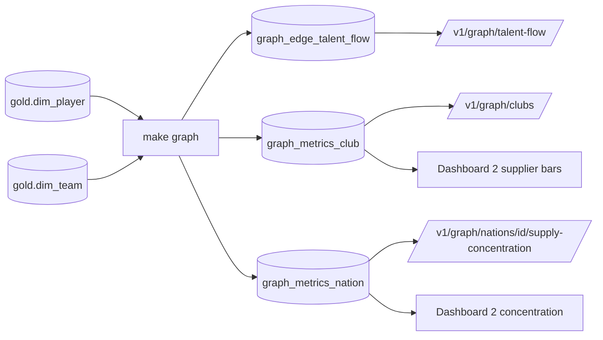

# Module 6 — Graph Analytics (Talent Flow)

## 1. Requirements
The minimal in-scope graph module (scope.md R2): a club <-> national-team
talent-flow network from player club affiliations, its supplier/concentration
metrics served read-only via API and BI. Event-data pass networks are anti-scope
and data-infeasible (match_events carries only Goal/Assist/Card/VAR).

## 2. Architecture
A NetworkX batch job (`make graph`) reads the warehouse and writes deterministic
metric tables to gold; the API and BI only read them — prediction-as-data,
extended to graph analytics.

A new `footballiq.graph` layer sits between `ml` and `infrastructure` in the
import-linter contract (ADR-0002): the batch job may read infrastructure, but
neither `ml` nor the API's graph reads depend on NetworkX.

## 3. Design rationale
- **Bipartite, one graph.** Nodes = ~450 clubs (normalized `club_team` string,
  no dim_club) + 48 nations (dim_team). Edge = club supplies player(s) to a
  nation; weight = player count, value-weighted = sum market value. One-mode
  projections (nation<->nation) derive on demand and are structurally symmetric.
- **NetworkX in batch, no graph DB.** ~500 nodes / <=1,248 edges — a graph
  database (Neo4j) would be ceremony; NetworkX computes degree/HHI directly.
- **Metrics as analytics, not ML features.** Club centrality as a valuation
  feature is a future extension (a major feature_version bump), deliberately not
  wired into the model (graph-design §5).
- **Cross-confederation metric deferred.** The design lists it, but clubs are a
  bare string with no club->confederation mapping in the warehouse, so it is
  data-infeasible in MVP — recorded here rather than faked.

## 4. Implementation
- **Build (`graph/build.py`):** aggregates `dim_player ⋈ dim_team` into the
  bipartite graph, computes club metrics (nations supplied, players supplied,
  value exported) and nation metrics (supplier count, players total, total
  value, player-count HHI), writes three gold tables in one transaction,
  versioned by `graph_version`. Real run: 957 edges, 450 clubs, 48 nations,
  1,248 players — the squad-total reconciliation holds exactly.
- **Serving (`api/routers/graph.py`):** `GET /v1/graph/talent-flow` (edge list,
  doubles as network-viz data), `/v1/graph/clubs?sort=value_exported` (supplier
  ranking), `/v1/graph/nations/{id}/supply-concentration` (HHI + top suppliers).
  Same four-layer DI as every other read model.
- **BI:** `graph_top_suppliers.sql` (ranked supplier bars) and
  `graph_nation_concentration.sql` (concentration risk) join Dashboard 2.

## 5. Testing
Hand-computed fixture pins the metrics exactly — club weighted degree / value
exported, nation HHI (5/9 and 1/2) — plus the two structural checks the design
calls for: edge `player_count` reconciliation to the squad total and
projection symmetry, and build determinism. API tests cover the edge list, the
sorted club ranking, nation concentration with shares, the unknown-nation 404,
and auth. Not unit-tested: the live warehouse build path (validated end-to-end
by `make graph`).

## 6. Future improvements
- Cross-confederation exposure once a club->confederation dimension exists.
- Club centrality as a valuation feature (feature_version bump; graph-design §5).
- Streamlit network diagram over `/v1/graph/talent-flow` (M8).
- Neo4j / value-weighted projections if the graph grows beyond MVP scale.

---

## Portfolio annex
- **Skills demonstrated:** graph modeling (bipartite projection), network
  metrics (weighted degree, HHI concentration), batch analytics as
  prediction-as-data, clean-architecture layering of a new capability.
- **Interview questions prepared:** "When do you reach for a graph database vs
  an in-memory library?" "How would you measure supplier concentration risk?"
  "How do you keep a new analytics capability from leaking across architecture
  layers?"
- **Enterprise concepts applied:** supplier-concentration risk (HHI),
  supply-chain network analytics, deterministic batch metric products.
- **Resume bullet:** "Built a club<->nation talent-flow graph (NetworkX) with
  supplier importance and HHI concentration metrics, served read-only over a
  layered FastAPI + BI stack, reconciled exactly to squad totals."
- **LinkedIn:** "v0.6.0: the platform now sees the talent supply chain as a
  network — which clubs feed which nations, and which squads depend on a
  handful of suppliers (an HHI concentration metric borrowed straight from
  economics)."
