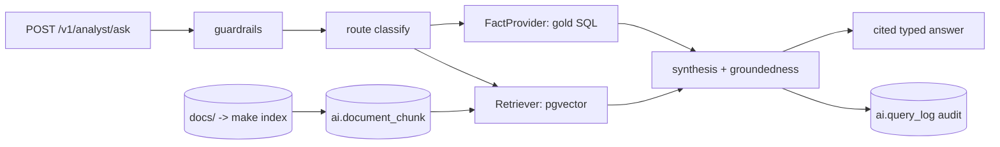

# Module 7 — AI Analyst (RAG)

## 1. Requirements
Single-turn RAG assistant (scope story 3): answer questions about the platform
grounded in the warehouse and indexed docs, with the hard rule that **numbers
never come from the model** — every numeric fact is executed SQL, cited. Five
demo questions must answer reliably. Consumes existing modules; changes none.

## 2. Architecture
A `POST /v1/analyst/ask` endpoint in the existing API, plus a batch embedding
job. Pipeline (application layer) over ports; adapters in infrastructure.

New `ai` schema (pgvector), one router, ports (Embedder, ChunkStore, Retriever,
FactProvider, LLMClient, QueryLog), one batch job (`make index`), one DB role
(`fiq_analyst`, SELECT on gold + ai). Layers hold: the pipeline is application,
adapters infrastructure; nothing below gold is reachable by the analyst role.

## 3. Design rationale
- **Numbers from SQL, not embeddings (rag-design §1).** Retrieval finds
  definitions and routes; the `FactProvider` runs a per-route SQL catalog for
  every figure. Enforced by a **groundedness check**: each numeric token in the
  answer must appear in the tool evidence, or the answer is flagged ungrounded.
- **Deterministic routing.** Normalized keyword matching (lowercase, punctuation
  stripped, crude singular/plural folding) — reproducible and CI-checkable. Its
  literalness is the known trade-off; the `LLMClient` port is the robustness
  upgrade path.
- **pgvector in the existing Postgres.** No parallel vector service for a few
  thousand chunks; exact cosine scan at this scale, HNSW documented as flip-on.
- **Local, free embeddings** (bge-small-en-v1.5): same model for docs and
  queries; incremental re-index on content-hash diff.
- **LLM deferred, seam ready.** Answers are grounded and cited with a
  deterministic template today; a hosted model slots behind `LLMClient` without
  touching the pipeline (groundedness is re-checked on its output).
- **Least privilege + audit.** The analyst reads through `fiq_analyst`
  (gold + ai only); `ai.query_log` records every answer (route, groundedness,
  evidence counts, response hash, versions) so it is reconstructible.

## 4. Implementation
- **Indexing:** heading-aware Markdown chunker + `index_documents` (content-hash
  incremental) + `SentenceTransformerEmbedder` + `PgVectorChunkStore`;
  `make ai-up` provisions the schema/role, `make index` embeds docs (226 chunks
  live: 147 docs, 49 module reports, 30 ADRs).
- **Ask pipeline:** guardrails -> `classify` -> `GoldFactProvider` (KPI /
  prediction / graph / explanation SQL) + `SemanticRetriever` -> template (or
  LLM) synthesis -> `is_grounded` -> cited `AnalystResponse` with facts,
  citations, versions. Empty evidence answers "cannot answer".
- **Audit:** `PgQueryLog` writes `ai.query_log` on every answer.

## 5. Testing
`make check` green. Pure logic fully covered: chunker, indexing, routing
(incl. phrasing variations), grounding (grounded + fabricated-number cases),
pipeline (facts, refusal, guardrails, audit, LLM seam), and a golden eval over
the 5 demo questions (routes + groundedness). Adapters (embeddings, pgvector,
SQL fact catalog, query-log) are integration-only, validated by `make index`
and the live endpoint. Live answers verified: squad value, top undervalued
player, SHAP drivers, and DOCS retrieval, each with numbers traceable to gold.

## 6. Future improvements
- Hosted LLM behind `LLMClient` (Anthropic/OpenAI via config) for natural
  phrasing and robust routing.
- Constrained NL->SQL fallback (single SELECT, gold-only, sqlglot validation)
  beyond the fixed catalog.
- HNSW index and hybrid keyword (Postgres FTS) lane at scale.
- Golden-set expansion (~25 incl. adversarial + true-answer-is-no-data),
  LLM-judge faithfulness per release.

---

## Portfolio annex
- **Skills demonstrated:** RAG over pgvector, grounded generation with a
  programmatic groundedness guarantee, least-privilege data access, audit
  logging, deterministic + extensible routing, local embeddings.
- **Interview questions prepared:** "How do you stop a RAG system from
  hallucinating numbers?" "Why keep facts in SQL and only phrasing in the LLM?"
  "How do you make an LLM feature testable in CI?" "How do you scope a database
  role for an AI assistant?"
- **Enterprise concepts applied:** retrieval-augmented generation, groundedness
  / faithfulness evaluation, least-privilege access, reconstructible audit,
  provenance on every answer.
- **Resume bullet:** "Built a single-turn RAG analyst (pgvector + local
  embeddings) with a programmatic groundedness check ensuring every numeric
  claim traces to executed SQL, least-privilege data access, and a
  reconstructible audit log."
- **LinkedIn:** "v0.7.0: the platform can answer questions in plain English —
  and every number it states is provably pulled from SQL, not made up by a
  model. Grounded AI, audited end to end."
