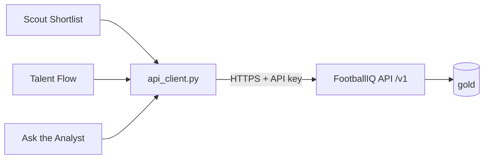

# Module 8 — Customer Portal (Streamlit)

## 1. Requirements
The customer-facing portal for the three user stories (scope story 1-3),
delivered as a Streamlit app that reads the FootballIQ API **only** — no direct
warehouse access. The constraint is the point: a working client over the public
contract proves the API is sufficient (xai-design §5).

## 2. Architecture
A standalone `portal/` app, outside the layered `footballiq` package (it is a
consumer, not a layer). One typed HTTP client is the sole data source; three
Streamlit pages are thin views over it.

The portal never imports `footballiq`; it speaks HTTP. This is the architectural
proof that the API — not shared code — is the integration boundary.

## 3. Design rationale
- **API-only, enforced by structure.** `api_client.py` uses httpx and has no
  database driver and no `footballiq` import. There is literally no code path to
  the warehouse.
- **Testable core, thin views.** All request logic lives in the client (paths,
  API-key header, params, error surfacing) and is unit-tested with
  `httpx.MockTransport`. The Streamlit pages hold only rendering, so the
  quality-gated logic is the part that matters.
- **Three pages, three stories.** Scout Shortlist (story 1: valuations +
  SHAP), Talent Flow (graph metrics), Ask the Analyst (story 3: grounded RAG).
- **Config, not code.** API URL and key come from the sidebar or env
  (`FIQ_API_URL`, `FIQ_API_KEY`), so the same portal points at local or Azure.

## 4. Implementation
- `portal/api_client.py` — typed httpx wrapper (valuations, explanation, graph
  clubs, nation concentration, teams, analyst ask); httpx errors become
  `ApiError`.
- `portal/app.py` — landing + connection sidebar + reachability check.
- `portal/pages/` — Scout Shortlist (value-gap table, per-player metrics, SHAP
  driver bars), Talent Flow (supplier bars, nation HHI + top suppliers), Ask the
  Analyst (grounded badge, answer, SQL facts, citations).
- `make portal` (`streamlit run portal/app.py`); `portal` extra (streamlit,
  httpx, pandas). Lint now covers `portal`; the API client is unit-tested.

## 5. Testing
`make check` green: the client is tested via `httpx.MockTransport` for endpoint
paths, the API-key header, query params, JSON parsing, and error surfacing —
proving the API-only contract without a running server. Streamlit pages are
rendering-only (not unit-tested; the value is in the client, which is). Live
demo verified against the running API.

## 6. Future improvements
- Server-side caching of read models (Streamlit `st.cache_data`) for snappier UX.
- Network diagram for talent flow (the edge list is already exposed).
- Auth beyond a shared API key (per-user keys) for a hosted deployment.
- Download/export of shortlists (CSV) from the valuations page.

---

## Portfolio annex
- **Skills demonstrated:** building a decoupled client over a documented API,
  contract-first integration, testable HTTP client design, Streamlit UX.
- **Interview questions prepared:** "How do you prove an API is sufficient for
  its clients?" "Why keep the portal out of the shared codebase?" "How do you
  test a UI-adjacent HTTP client without a live server?"
- **Enterprise concepts applied:** API as the integration boundary,
  separation of client and platform, config-driven environments.
- **Resume bullet:** "Built a Streamlit customer portal that consumes the
  platform's public API exclusively (no shared code, no DB access), with a
  typed, unit-tested HTTP client — demonstrating API-contract sufficiency."
- **LinkedIn:** "v0.8.0: a scouting portal that talks to the platform only
  through its public API — the same contract any external customer would use.
  Clean boundaries make systems replaceable."
