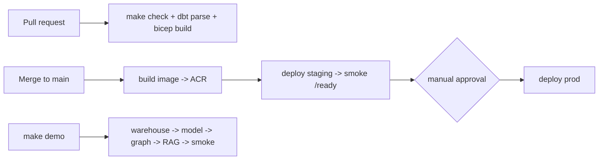

# Module 9 — Ship (Docker, CI/CD, IaC, Demo)

## 1. Requirements
Turn the platform into something deployable and reproducible: a one-command
end-to-end demo, container images, CI that mirrors local checks, validated Bicep
IaC for Azure, deploy workflows with a staging gate, and an operations runbook.
This is the module that makes everything a *product*, not a repo.

## 2. Architecture
Local is the source of truth; Azure is placement (ADR-0003). Same containers run
locally (compose) and in the cloud (ACA); the same `make check` runs locally and
in CI; the same init SQL migrates both.

## 3. Design rationale
- **One command, honest verification.** `make demo` chains the whole pipeline
  (warehouse -> features -> train -> score -> graph -> ai schema -> RAG index)
  and ends with `scripts/demo_smoke.py`, which fails if any layer is empty — the
  demo can't pretend success.
- **CI == local.** CI runs `make check` verbatim (ruff, mypy, import-linter,
  tests against real Postgres) plus offline `dbt parse` and a Bicep build; no
  drift between "works on my machine" and the gate.
- **IaC is placement, not redesign.** Bicep provisions ACA + PG Flexible Server
  (pgvector native) + ACR/KV/Blob/Log Analytics. The adapter ports
  (storage/LLM/config) and DB roles were built for this swap, so no application
  code changes.
- **Staging gate + reversible deploys.** Merge deploys staging and smoke-tests
  `/ready` before a manual approval to prod; rollback is ACA revision pinning
  (instant) or PG PITR (data), documented in the runbook.
- **Portfolio-tier honesty.** Public endpoints + TLS + firewall now; VNet,
  private endpoints, and managed-identity DB auth are the documented production
  step, not silently implied.

## 4. Implementation
- `make demo` + `scripts/demo_smoke.py` (six-layer smoke check).
- Multi-stage `Dockerfile` (builder -> slim non-root runtime; one image, many
  jobs — the ACA Jobs pattern).
- `.github/workflows/ci.yml` (quality gate, from M3) and `deploy.yml` (validate
  IaC -> build -> staging -> smoke -> approval -> prod, OIDC auth).
- `infra/bicep/main.bicep` (+ `staging.bicepparam`, README): the full portfolio
  stack, parameterized by environment; `az bicep build` validates offline.
- `docs/runbook.md`: run, deploy, rollback, backup/restore, incident response,
  secrets, routine checks.

## 5. Testing
`make check` green (unchanged core). `make demo` is the end-to-end acceptance
test — it builds every layer on real data and asserts each is populated. `az
bicep build` compiles + lints the IaC. CI reproduces the local gate on every PR;
`deploy.yml` gates prod behind a staging smoke test and manual approval.

## 6. Future improvements
- Batch jobs (ingest/dbt/score/embed) as first-class ACA Jobs (cron) in Bicep.
- Production networking (VNet, private endpoints) and managed-identity DB auth.
- App Insights dashboards + cost-anomaly alerting wired in IaC.
- Blue/green or canary via ACA traffic splitting.

---

## Portfolio annex
- **Skills demonstrated:** IaC (Bicep), GitHub Actions CI/CD with a staging
  gate, container image design, one-command reproducible demos, operational
  runbooks, cloud cost awareness.
- **Interview questions prepared:** "Walk me through your deploy pipeline and
  rollback story." "How do you keep CI and local checks from drifting?" "How
  would you take this from a portfolio tier to production?" "How do you verify a
  full-stack demo actually works?"
- **Enterprise concepts applied:** infrastructure as code, environment
  promotion with approval gates, least-privilege cloud identities, DR tiers with
  honest RTO, cost governance.
- **Resume bullet:** "Shipped a cloud-deployable analytics platform: multi-stage
  Docker images, CI mirroring local quality gates, validated Bicep IaC for Azure
  Container Apps + PostgreSQL (pgvector), and a staging-gated deploy pipeline
  with a one-command end-to-end demo."
- **LinkedIn:** "v1.0.0 — FootballIQ is complete: ingest to warehouse to models
  with SHAP, a versioned API, dashboards, a talent-flow graph, a grounded RAG
  analyst, and a portal — deployable to Azure via Bicep, reproducible with one
  command. Ten modules, production-grade per layer."
