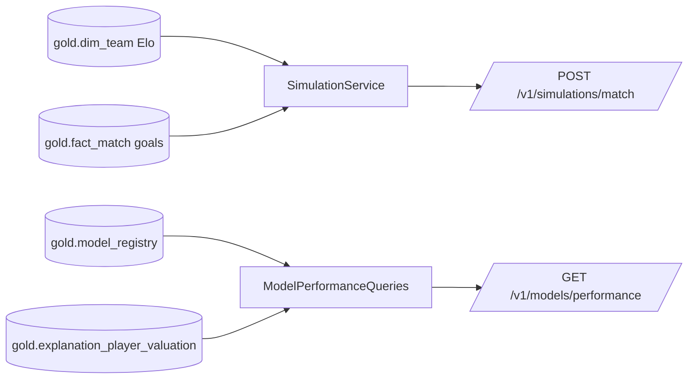

# Module 10 — Match Simulation & Model Governance

## 1. Requirements
The production frontend (frontend blueprint §18) needs a match simulator and
a model-performance view. ADR-0006 admits exactly these two capabilities and
rejects the dishonest ones (live predictions, event intelligence,
qualification odds — no data source in the warehouse).

## 2. Architecture
Same clean-architecture shape as every other slice: protocols in
`application/read_models.py`, use cases in `application/simulation.py` and
`application/model_performance.py`, gold adapters in
`infrastructure/gold/{simulation,model_performance}.py`, thin routers, DTOs
in `api/schemas.py`. Wiring happens only in the composition root
(`api/main.py`). No existing module changed behavior.

## 3. Simulation methodology (every assumption explicit)
1. **Elo win expectancy** `We = 1/(1+10^(-(elo_h-elo_a)/400))` — standard
   scale, venue-neutral (World Cup: no true home side).
2. **Total-goal rate** `mu` = mean(home+away goals) over completed matches in
   `gold.fact_match`. With zero completed matches the documented fallback is
   `172/64 = 2.6875` (FIFA World Cup 2022 average) — a sourced constant. The
   response labels which was used (`goal_rate_source`).
3. **Goal split**: `lambda_h = mu*We`, `lambda_a = mu*(1-We)` — a declared
   simplification (goal share ~ strength share).
4. **Sampling**: two independent Poisson processes (Knuth sampler, stdlib
   `random.Random(seed)`; no numpy in the application layer). Poisson goals
   are the classical baseline (Maher 1982).
5. **Uncertainty**: every probability ships with a Wilson 95% interval for
   the actual Monte Carlo sample size; the score matrix caps at 5+ per side.
6. **Reproducibility**: identical inputs + seed ⇒ byte-identical response
   (asserted in tests). `n_runs` ∈ [100, 10000], default 5000.
7. The full assumption list is returned **in the response body** — the
   methodology travels with the numbers.

## 4. Model governance endpoint
`GET /v1/models/performance` returns, verbatim from the warehouse:
registry entries (version, feature version, git commit, params, seed, status,
training-time CV metrics for xgboost **and** both baselines) and global
feature importance (`avg(abs(shap_log))` per feature over all stored
explanation rows, with player counts). Nothing is recomputed at request time;
the accuracy note (±20% band) ships in-band, as everywhere else.

## 5. Error contract
404 unknown team / empty registry · 409 team without Elo rating ·
422 same team twice, `n_runs` out of bounds (RFC 7807 problem+json, as
everywhere).

## 6. Deferred
Qualification probability — FIFA tie-breakers (disciplinary points, drawing
of lots) are not in the warehouse; see ADR-0006.

## 7. Tests
`tests/unit/test_simulation_math.py` (Elo identities, Wilson bounds/width,
Poisson mean + determinism), `tests/unit/test_api_simulations.py` (auth,
probability algebra, favourite ordering, determinism, distribution sums,
rate-source labeling, 404/409/422), `tests/unit/test_api_models.py`
(auth, lineage + baselines + ordering, empty-registry 404).
